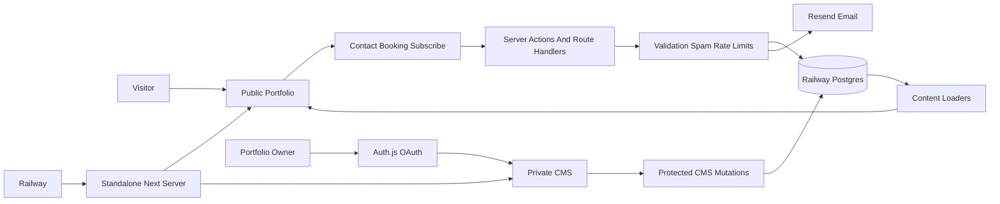
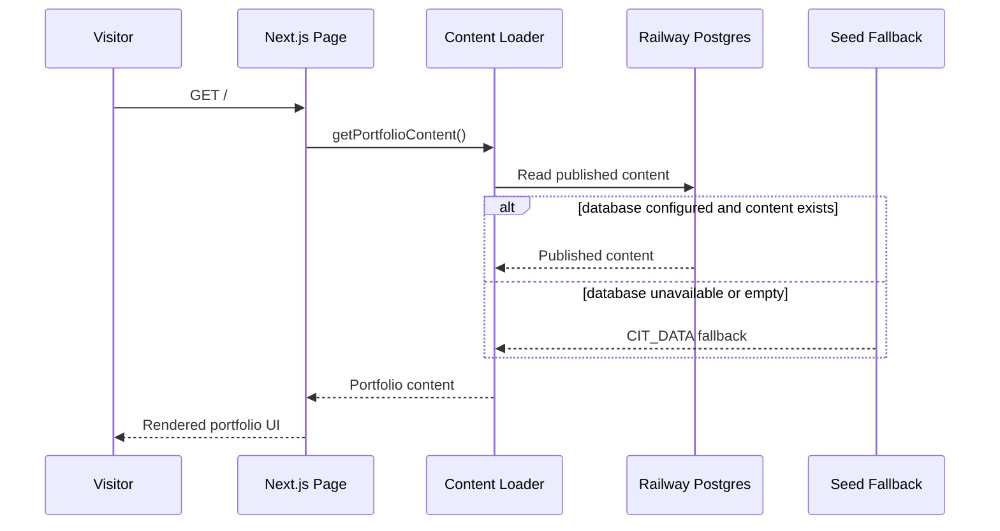
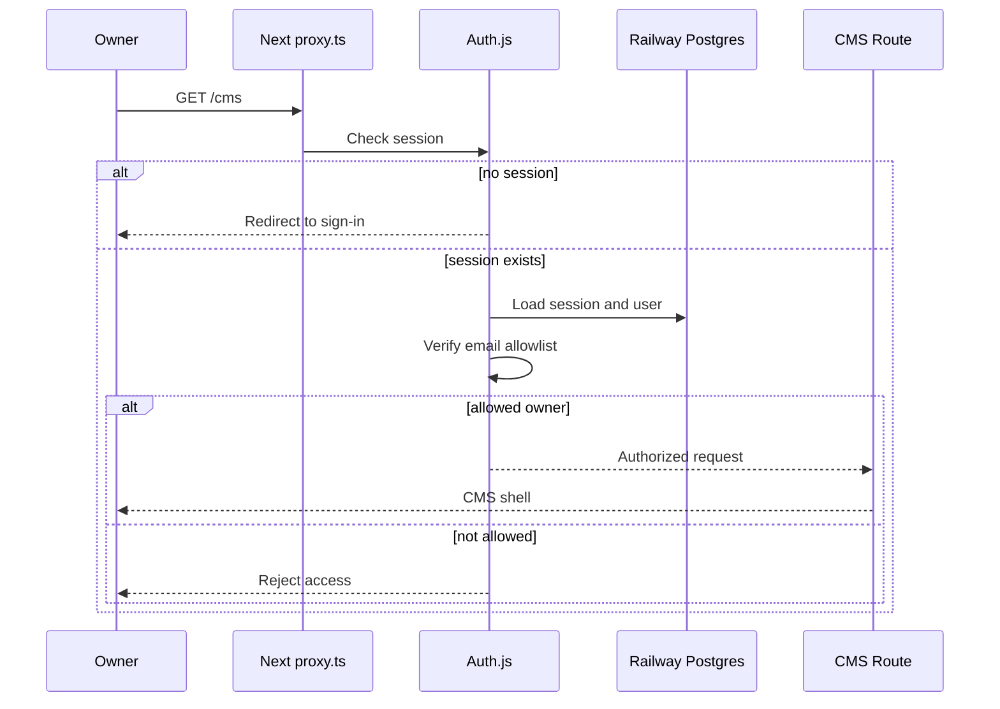
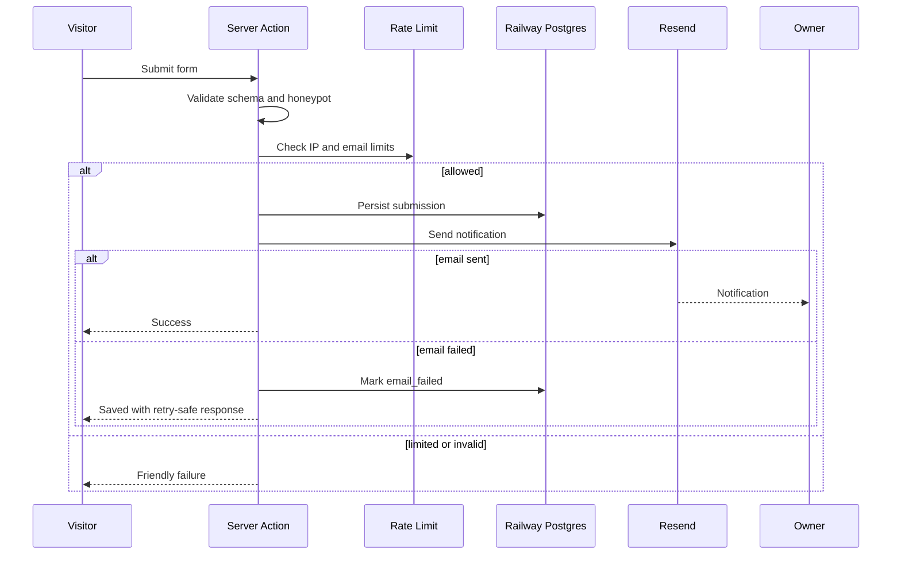
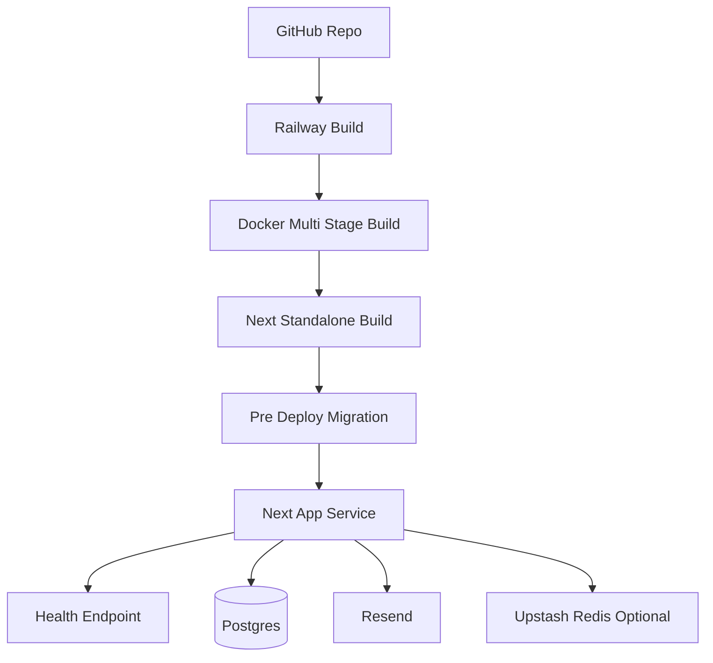

# AURA Portfolio System Architecture

## Purpose

AURA turns the current portfolio from a polished static interface into a small production system: public site, private CMS, durable content store, authenticated admin boundary, email-backed inbound flow, and Railway deployment contract.

The goal is to keep the MAX UI intact while adding the backend foundations early enough that future features do not grow around weak boundaries.

## System Context

## Runtime Components

- **Next.js App Router:** Owns the public portfolio, CMS UI, server actions, route handlers, and health endpoint.
- **Railway Postgres:** Source of truth for content, Auth.js session tables, inbound inquiries, booking requests, subscribers, audit events, and integration settings.
- **Drizzle ORM:** Typed schema and migration layer. Drizzle stays close to SQL and keeps the portfolio CMS lightweight.
- **Auth.js:** OAuth-based admin authentication with database sessions and owner-email allowlisting.
- **Resend:** Transactional email provider for contact, booking, and subscription notifications.
- **Upstash Redis rate limits:** Optional production limiter for public forms. The app falls back to validation and persistence when Redis is not configured, but production should configure it.
- **Railway Docker service:** Runs the standalone Next.js server produced by `output: "standalone"`.

## Actor Model

- **Visitor:** Reads the portfolio, sends an inquiry, books a hold, or subscribes to devlog updates.
- **Portfolio Owner:** Authenticates into `/cms`, edits content, reviews inbound messages, and manages publication state.
- **OAuth Provider:** Google or GitHub provider used only to authenticate the owner. No password storage belongs in this app.
- **Email Provider:** Resend sends owner notifications and optional visitor confirmations.
- **Railway Platform:** Provides app runtime, Postgres, environment variables, deployment health checks, and pre-deploy migration execution.

## Data Ownership

Railway Postgres is authoritative for production data. Static `CIT_DATA` remains valuable as a seed and local fallback, not as the runtime source of truth once content has been migrated.

Core data groups:

- **Auth:** `users`, `accounts`, `sessions`, `verification_tokens`, `authenticators`.
- **Content:** profile, stats, experience, projects, stack groups/items, devlog posts, appearance settings.
- **Inbound:** contact inquiries, booking requests, newsletter subscribers.
- **System:** audit events and integration settings.

## Public Portfolio Flow

The public page should tolerate empty or temporarily unavailable CMS data. The fallback keeps the portfolio online while the backend is being provisioned, while production observability should still flag database failures.

## CMS Auth Flow

Authorization is defense in depth. The proxy protects navigation, but every CMS mutation must also call the server-side admin guard before touching data.

## Inbound Email Flow

Persist first, send second. Leads should not disappear because Resend is down or slow. Retries must not create duplicate inquiry records for the same normalized email and submission fingerprint.

## Railway Deployment

Deployment rules:

- Build a standalone Next.js server with `output: "standalone"`.
- Run migrations before the new service starts serving traffic.
- Fail the deploy if migrations fail.
- Keep secrets server-only. Do not prefix secrets with `NEXT_PUBLIC_`.
- Use separate Railway environments for staging and production.
- Use Railway reference variables for database credentials.

## Environment Contract

Required in production:

- `DATABASE_URL`
- `AUTH_SECRET`
- `AUTH_TRUST_HOST`
- `ADMIN_EMAILS`
- `NEXT_PUBLIC_SITE_URL`
- `RESEND_API_KEY`
- `EMAIL_FROM`
- `CONTACT_TO_EMAIL`

OAuth provider variables:

- `AUTH_GITHUB_ID`
- `AUTH_GITHUB_SECRET`
- `AUTH_GOOGLE_ID`
- `AUTH_GOOGLE_SECRET`

Optional rate-limit variables:

- `UPSTASH_REDIS_REST_URL`
- `UPSTASH_REDIS_REST_TOKEN`

## Edge Cases

- Direct `/cms` visits without a session redirect to sign-in.
- OAuth users outside `ADMIN_EMAILS` are rejected even if provider auth succeeds.
- Expired sessions are rechecked before mutations.
- CMS mutations must be transactional and audit logged.
- Concurrent admin edits should use `updated_at` or version fields before overwriting data.
- Form spam should be blocked by schema validation, honeypot fields, and rate limits.
- Email failure after database persistence should mark the record for retry instead of losing it.
- Missing production environment variables should fail loudly during server-only operations.
- Public rendering should fall back to seed content if database content is not available during early deployment.
- Railway migration failure should stop the new deployment.

## Rollout Sequence

1. Commit architecture and deployment contract.
2. Add Drizzle schema, migrations, and seed path.
3. Add Auth.js owner-only CMS protection before enabling mutations.
4. Move public content reads behind content loaders.
5. Add contact, booking, and subscribe server actions.
6. Add Railway Docker, env template, health endpoint, and migration pre-deploy command.
7. Add tests for validation, guards, loaders, and production build behavior.

## Future Expansion

- Add a worker service only when email retries, media processing, or scheduled publishing need background execution.
- Add Railway buckets only when CMS media uploads become real.
- Add team roles only after there is a real second admin.
- Add analytics only after the core content and inbound flows are stable.
